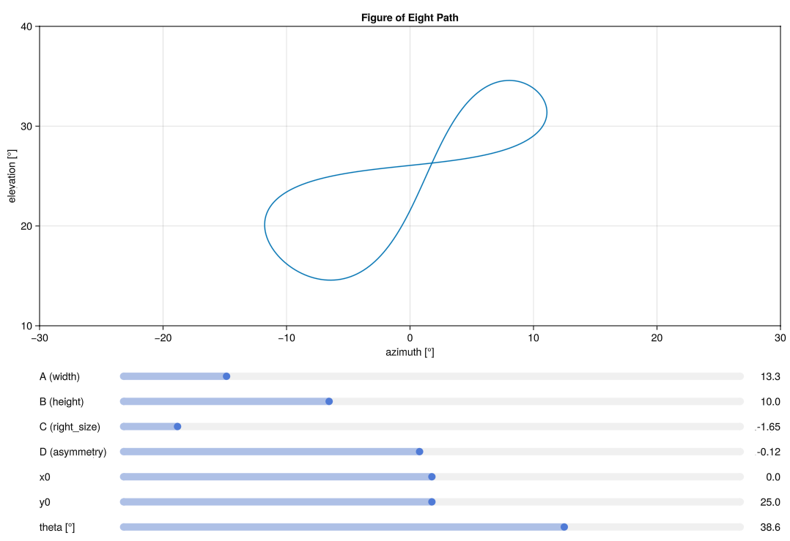

# OptimalFlightPaths

[](https://github.com/OpenSourceAWE/OptimalFlightPaths.jl/actions/workflows/CI.yml?query=branch%3Amain)

## Installation

First, install Julia 1.10 or newer as explained [here](https://ufechner7.github.io/2024/08/09/installing-julia-with-juliaup.html).

Checkout this repo:

```bash
git clone https://github.com/OpenSourceAWE/OptimalFlightPaths.jl.git
```
Start Julia with
```bash
cd OptimalFlightPaths.jl
julia --project
```

Install the dependencies with:
```julia
using Pkg
Pkg.instantiate()
```

Run the first example with:
```julia
include("examples/create_flightpath.jl")
```
You should see a tilted figure of eight.

The second example uses sliders to modify 7 parameters:
```julia
include("examples/sliders.jl")
```



